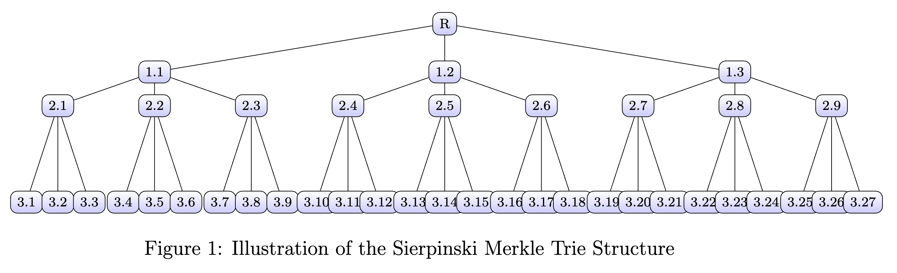

# Section 1: System Overview

Asynchronous Sharding

> Asynchronous sharding is crucial for scaling blockchain systems. In this model, different shards (sub-networks) process transactions independently, enabling parallel processing and increased throughput. This can be mathematically represented as:

$$
\text{Shards: } \mathcal{S} = \{S_1, S_2, \ldots, S_n\}
$$

$$\text{Each shard} ( S_i )$$ operates independently, handling a subset of transactions. The goal is to maximize throughput $$( \theta ) \text{and minimize latency} ( \lambda )$$:

$$
\theta = \sum_{i=1}^{n} \theta_{S_i}, \quad \lambda = \min_{i} (\lambda_{S_i})
$$

#### Client-Side Ordinal Transaction Ordering

> In this mechanism, transactions within each shard are ordered using a client-based approach, which can be formalized as:

$$
\text{Ordinal Rank}(\text{Transaction } T) = f(T, \text{Client Data})
$$

Here,  $$( f )$$  represents a function that assigns a unique rank to e ach transaction based on client-side data, ensuring an efficient and decentralized ordering process.&#x20;

#### Triadic Consensus

> Triadic consensus is a novel approach to achieving consensus in a distributed system. It can be represented as:

$$
\text{Consensus}(T) = \begin{cases} 1 & \text{if majority of nodes in triad agree on } T \\ 0 & \text{otherwise} \end{cases}
$$

This mechanism enhances efficiency and fault tolerance in the network.

#### Sierpinski Merkle Trie Structure

> The Sierpinski Merkle Trie $$(SMT)$$ structure enables efficient transaction proofs and ordering. It can be represented as a recursive data structure:

$$
\text{SMT}(T) = \begin{cases} \text{hash}(T) & \text{if } T \text{ is a leaf node} \\ H(\text{SMT}(C_1), \ldots, \text{SMT}(C_k)) & \text{otherwise} \end{cases}
$$

Here, $$(H)$$ is a hash function, and $$( C_i )$$ are child nodes of $$( T )$$. This structure facilitates efficient verification and aggregation of transactions.

<figure><figcaption></figcaption></figure>
